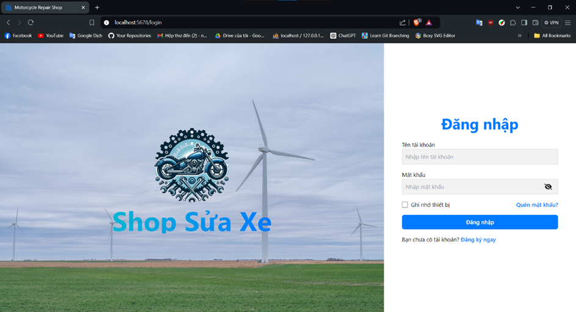
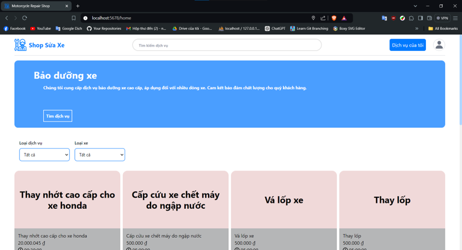
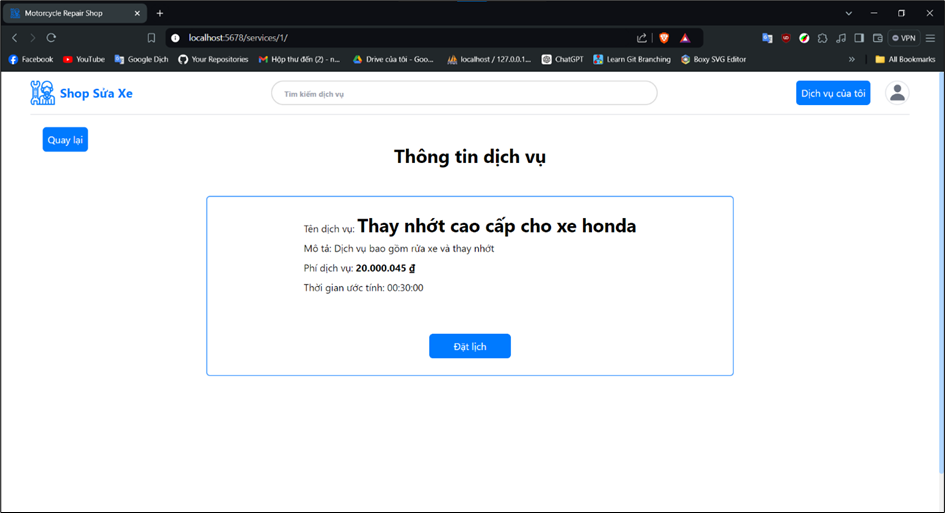
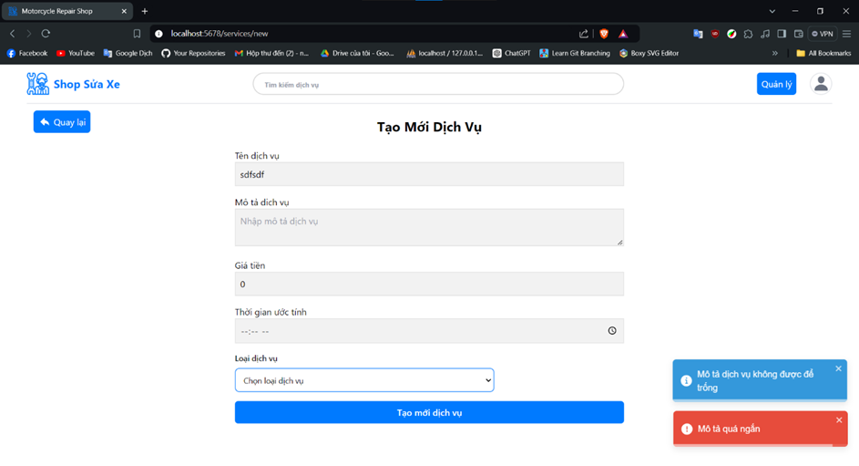
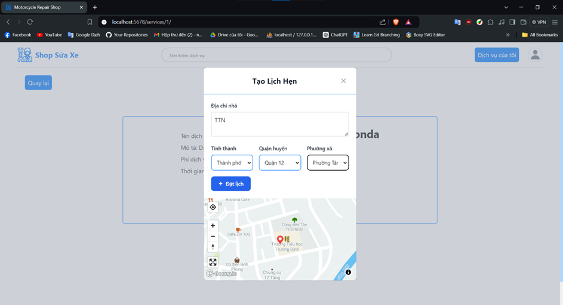
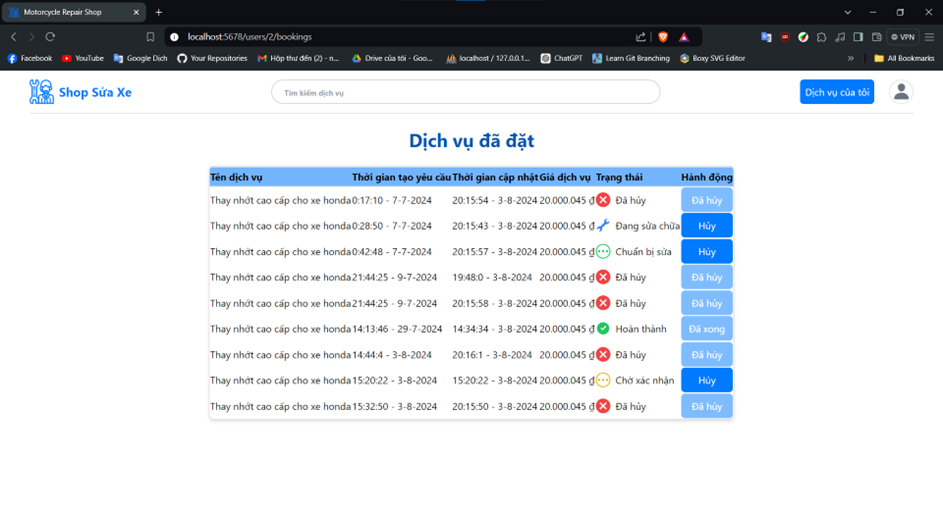
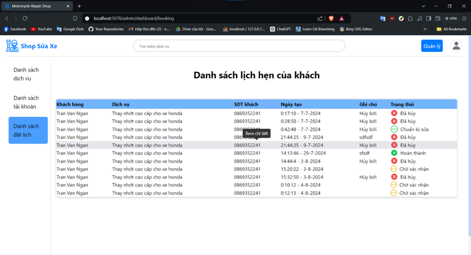
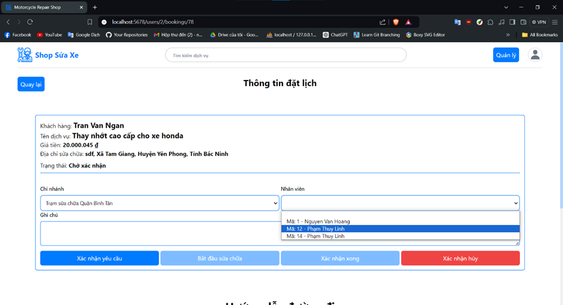
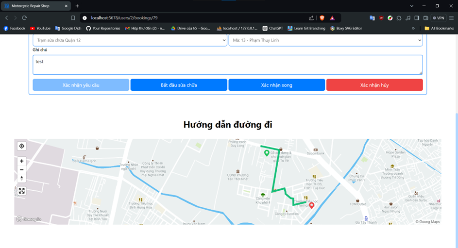

# Motorcycle Repair Shop Website 👋

A website that allows you to schedule motorcycle repairs at home. It is built using:
* [Vite](https://vitejs.dev/)
* [React](https://reactjs.org/)
* [Tailwind CSS](https://tailwindcss.com/).
* [Goong Map React](https://docs.goong.io/goong-map-react/)

## 1. Installation and Usage

1. Clone the repository

```bash
git clone https://github.com/ngantrandev/vehicle-repair-shop-web.git

```

2. Create a `.env` file in the root directory of the project and add the following environment variables:

```bash
VITE_WEB_NAME = Motorcycle Repair Shop

VITE_API_BASE_URL = ***** (API URL)

VITE_GOONG_MAP_BASE_URL = https://rsapi.goong.io/ (API URL)
VITE_GOONG_MAP_TILE_KEY = ***** (GOONG MAP API KEY for calling map tiles)
VITE_GOONG_MAP_KEY = ***** (GOONG MAP API key for calling API)

VITE_DEFAULT_LATITUDE = ***** (DEFAULT LATITUDE FOR CENTER POINT ON MAP)
VITE_DEFAULT_LONGITUDE = ***** (DEFAULT LONGITUDE FOR CENTER POINT ON MAP)

```

3. Install dependencies

```bash
# Install dependencies
npm install

# Start the development server
npm run dev

# Build for production
npm run build

# Preview the production build
npm run preview
```

## 2. Website Preview
###  **Login Page**

    
###  **Home Page**


###  **Service Detail Page**


### **Create Service Page**


### **Create Booking Page**


### **Booking List Page User role**


### **Booking List Page Admin role**


### **Booking Detail Page**


### **Booking Detail Map Page**
